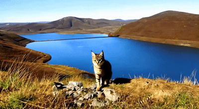
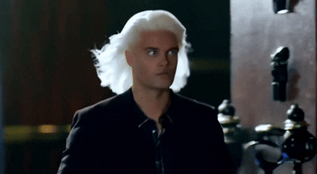
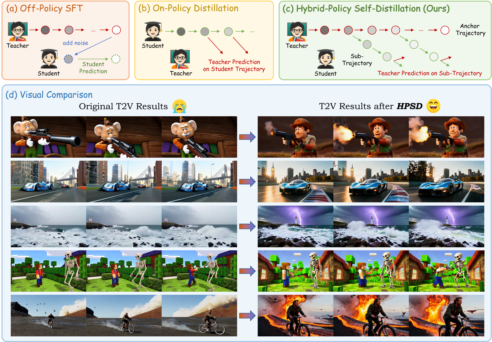
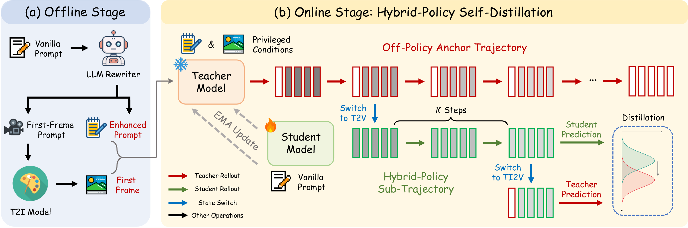

<div align="center">

<p align="center">
  
</p>

<h1>HPSD: Hybrid-Policy Self-Distillation for Text-Image-to-Video Diffusion Models</h1>

<div>
    <a href="https://scholar.google.com/citations?user=a8h9Di4AAAAJ" target="_blank">Jiazi Bu*</a><sup></sup> | 
    <a href="https://github.com/LPengYang/" target="_blank">Pengyang Ling*<sup>§</sup></a><sup></sup> | 
    <a href="https://github.com/YujieOuO" target="_blank">Yujie Zhou*</a><sup></sup> |
    <a href="https://codegoat24.github.io/" target="_blank">Yibin Wang</a><sup></sup> |
    <a href="https://yuhangzang.github.io/" target="_blank">Yuhang Zang</a><sup></sup> |
    <a href="https://scholar.google.com/citations?user=OeeH1HAAAAAJ&hl=en" target="_blank">Xuanlang Dai</a><sup></sup> | <br>
    <a href="https://scholar.google.com/citations?user=iDPJVBsAAAAJ&hl=zh-CN" target="_blank">Shengyuan Ding</a><sup></sup> | 
    <a href="https://wtybest.github.io/" target="_blank">Tianyi Wei</a><sup></sup> |
    <a href="https://xiaohangzhan.github.io/" target="_blank">Xiaohang Zhan</a><sup></sup> |
    <a href="https://myownskyw7.github.io/" target="_blank">Jiaqi Wang</a><sup></sup> |
    <a href="https://wutong16.github.io/" target="_blank">Tong Wu</a><sup></sup> |
    <a href="http://dahua.site/" target="_blank">Dahua Lin</a><sup></sup> |
    <a href="https://xingangpan.github.io/" target="_blank">Xingang Pan<sup>†</sup></a><sup></sup>
</div>
<br>
<div>
    <sup></sup>Shanghai Jiao Tong University, Nanyang Technological University, Shanghai AI Laboratory, 
    <br> University of Science and Technology of China, Fudan University, Shanghai Innovation Institute
    <br> The Chinese University of Hong Kong, CPII under InnoHK, JD.com, Adobe Research
</div>
(*<b>Equal Contribution</b>)(<sup>§</sup><b>Project Leader</b>)(<sup>†</sup><b>Corresponding Author</b>)
<br><br>


[](https://arxiv.org/abs/2608.13205) 
[](https://bujiazi.github.io/hpsd.github.io/)


---

<strong>HPSD is a hybrid-policy self-distillation framework for improving the base generation ability of TI2V models.</strong>

<details><summary>📖 Click for the full abstract of HPSD</summary>

<div align="left">

> Text-Image-to-Video (TI2V) models are an emerging unified architecture, where a single model simultaneously supports text-to-video (T2V) and image-to-video (I2V) generation. Given a high-quality first frame or a detailed textual prompt, TI2V models unlock substantially better visual quality than their T2V mode, raising a natural question: _can the capability elicited by such privileged conditions be internalized into the model's own base generation ability?_ A common approach toward this goal is model self-distillation. However, the most straightforward solution, supervised fine-tuning, follows an off-policy strategy: its supervision is confined to teacher-generated endpoints from a fixed offline distribution rather than student-visited states, lacking precise correction tailored to the evolving policy. Recent on-policy distillation methods instead suffer from condition-state mismatch, where supervision is steered toward the given first frame instead of the student's actual content, misleading the correction. To achieve self-distillation that absorbs the teacher's privileged prior while retaining precise policy correction, in this work, we propose **H**ybrid-**P**olicy **S**elf-**D**istillation (**HPSD**), a novel self-distillation framework where a single TI2V model acts as both teacher and student under different conditions: the teacher operates in TI2V mode with a high-quality first frame and an enhanced prompt, while the student runs in the base T2V mode with only the vanilla prompt. Specifically, the student inherits off-policy teacher trajectory points as anchors, locally refines them toward its own policy, and finally receives velocity-level supervision on these self-generated roll-outs. Extensive experiments demonstrate that HPSD significantly improves T2V performance while also delivering notable TI2V gains, effectively strengthening the model's base generation ability.
</details>
</div>

## 🎉 Quick Demos
More results can be found in the [Project Website](https://bujiazi.github.io/hpsd.github.io/).

<table class="center">
    <tr>
    <td style="text-align:center;"><b>Vanilla T2V</b></td>
    <td style="text-align:center;"><b>HPSD (Ours)</b></td>
    </tr>
    <tr>
    <td></td>
    <td></td>
    </tr>
    <tr>
    <td colspan="2" style="text-align:center;"><i>"a ship sailing in the ocean."</i></td>
    </tr>
    <tr>
    <td></td>
    <td></td>
    </tr>
    <tr>
    <td colspan="2" style="text-align:center;"><i>"cars doing a super race in New York."</i></td>
    </tr>
    <tr>
    <td></td>
    <td></td>
    </tr>
    <tr>
    <td colspan="2" style="text-align:center;"><i>"a long eared cat with stripes walking and blinking towards the camera on a hill"</i></td>
    </tr>
    <tr>
    <td></td>
    <td></td>
    </tr>
    <tr>
    <td colspan="2" style="text-align:center;"><i>"bar scene cinematic where a handsome young man with blue eyes is walking."</i></td>
    </tr>
    <tr>
    <td></td>
    <td></td>
    </tr>
    <tr>
    <td colspan="2" style="text-align:center;"><i>"Drone flyover of a Jovian sky colony."</i></td>
    </tr>
    <tr>
    <td></td>
    <td></td>
    </tr>
    <tr>
    <td colspan="2" style="text-align:center;"><i>"photo of coastline, rocks, distant lighthouse in the background, storm weather, strong wind, crashing waves, ..."</i></td>
    </tr>
</table>


## 🎨 Overview
<div style="width: 100%; text-align: center; margin:auto;">
    
</div>
<br>

## 💻 Method
<div style="width: 100%; text-align: center; margin:auto;">
    
</div>
<br>

HPSD lets the student start from the teacher's trajectory and finish under its own policy, which proceeds in the following stages: **(a) Offline Stage**: Before training, the privileged conditions are synthesized for each prompt with off-the-shelf generative models. **(b) Online Stage**: During training, the teacher first rolls out its full denoising trajectory under privileged conditions, yielding an off-policy anchor trajectory that carries the condition-elicited generation content; The student then continues denoising from intermediate states of the anchor trajectory with its own velocity field, and is supervised by the teacher on the resulting sub-trajectory. Since the supervised states are anchored by the teacher's policy yet evolved by the student's, we term this design a _hybrid-policy_.

</details>
</div>

## 🖋 News
- Our Project page is available now! (2026.8.14)
- Our Paper has been released on arXiv! (2026.8.14)

## 🏗️ Todo
- [ ] 🚀 Release HPSD code
- [x] 🚀 Release the project page
- [x] 🚀 Release paper

## 📎 Citation 

If you find our work helpful, please consider giving a star ⭐ and citation 📝 
```bibtex
@article{bu2026hpsd,
  title={HPSD: Hybrid-Policy Self-Distillation for Text-Image-to-Video Diffusion Models},
  author={Bu, Jiazi and Ling, Pengyang and Zhou, Yujie and Wang, Yibin and Zang, Yuhang and Dai, Xuanlang and Ding, Shengyuan and Wei, Tianyi and Zhan, Xiaohang and Wang, Jiaqi and others},
  journal={arXiv preprint arXiv:2608.13205},
  year={2026}
}
```

## 📣 Disclaimer

This is official code of HPSD.
All the copyrights of the demo images and audio are from community users. 
Feel free to contact us if you would like remove them.

## 💞 Acknowledgements
The code is built upon the below repositories, we thank all the contributors for open-sourcing.
* [Diffusers](https://github.com/huggingface/diffusers)
* [WAN-2.2](https://github.com/Wan-Video/Wan2.2)
* [LTX-2.3](https://github.com/Lightricks/LTX-2)
* [Z-Image](https://github.com/Tongyi-MAI/Z-Image)
* [Qwen3.6-27B](https://github.com/QwenLM/Qwen3.6)
* [D-OPSD](https://github.com/vvvvvjdy/D-OPSD)
